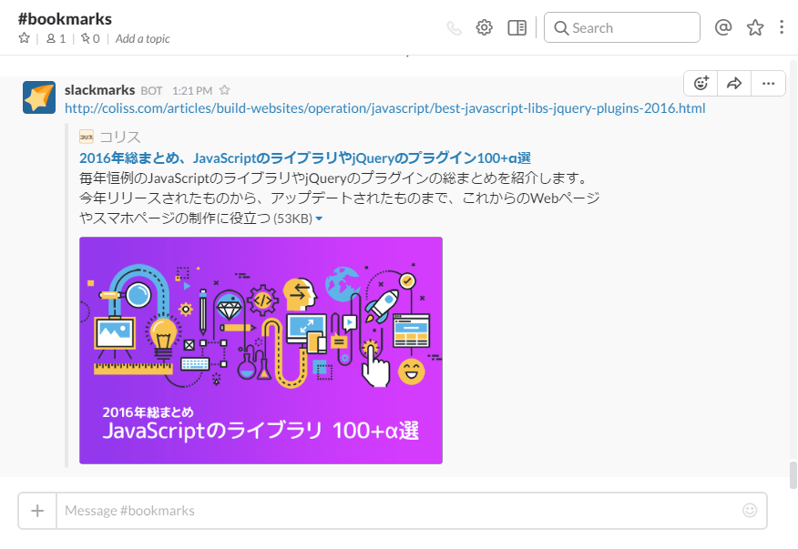
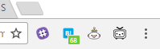

slackmarks
====

今開いている URL を Slack に投稿する Chrome Extension

## Install

## Settings

Manage extensions -> slackmarks -> Options

**request_url**: 投稿先チャンネルの Webhook URL (Incoming WebHookから取得)

**channel**: 投稿先のチャンネル （e.g. #bookmarks）

**botname**: 投稿された記事に表示されるユーザー名

channel は # を忘れずに

## Screenshots

